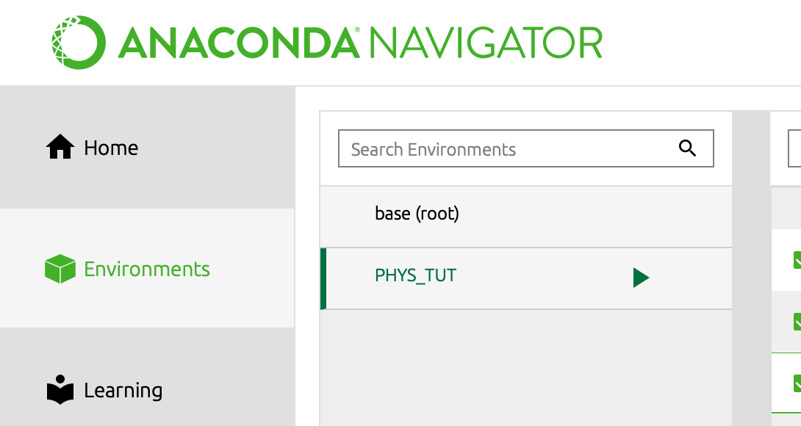
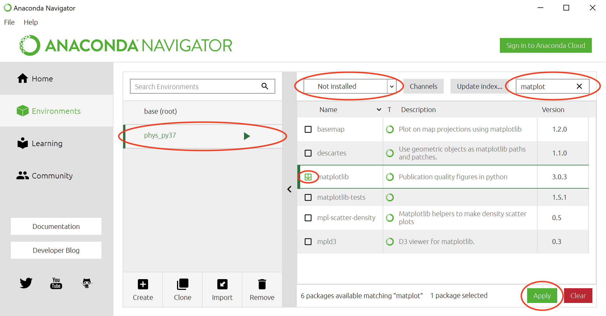
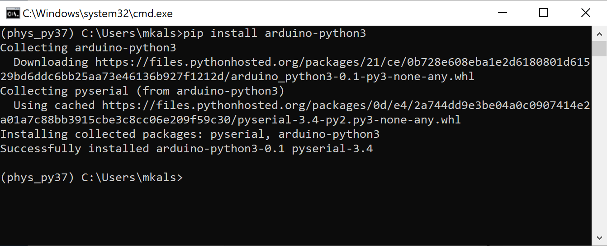
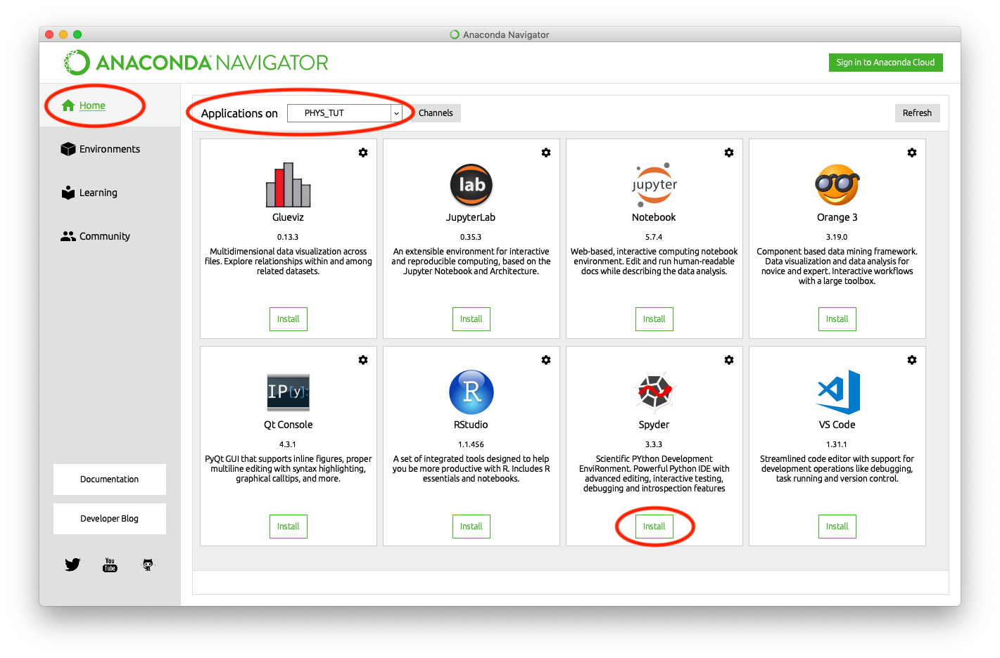

# 0. Setting Up the Tools
We are going to need a number of tools for the workshop, and we will install them all in this module. Do not worry if you do not understnad all the following steps and concepts, you will get familiar with it soon enough.

## Installing Anaconda
Anaconda is a package manager (program that helps you install all the things you need, and that keeps it organised) which is made for Python. To install Anaconda, do the following:

- Download the _Python 3.7 version_ installer suitable for your operating system from https://www.anaconda.com/download/
  - If you are using a Windows computer, you will need to know if your computer is built on a 32-bit or 64-bit architecture. You can find this by following the instructions in [this](https://www.howtogeek.com/howto/21726/how-do-i-know-if-im-running-32-bit-or-64-bit-windows-answers/) link.
  - If you are using a Mac made any time after 2007 you will have a 64-bit architecture. If your computer is older, see [this](https://www.macobserver.com/tips/how-to/mac-32-bit-64-bit/) guide.
- Run the installer.
- You will get a prompt to install Visual Studio Code. We do not need this text editor for this course, so you do not need to download it.

## Setting up a virtual environment
Different projects might need to use different versions of Python. We will, therefore, set up "virtual environments" every time we want to run Python code. This will also enable us to accessing the packages we want and ensure they do not conflict.
- Launch Anaconda Navigator
  - you will find Anaconda in launchpad on Mac or your start menu on Windows.
- Go to the _Environments_ tab on the left-hand side of the screen.
- Click the _Create_ button at the bottom of the screen.
- The dialogue seen in this figure will appear:

  - Give the environment a name of your choosing (for example "PHYS_TUT").
  - Select the check-box for Python and select 2.7 from the dropdown (yes, 2.7, not 3.7, even though you downloaded the 3.7 release). This is the version of Python we are going to use.
  - Ensure R is unchecked. R is a comletely separate programming language focussed on statistics applications.
  - Select _Create_.

You have now made your own environment. It may appear below your "base (root)" environment which is the global environment on your computer. Other applications may be using this global environment, so if we install packages here they may interfe. By keeping a seperate virtual envirnment, you are in control.

## Installing packages
Python is a very powerful and versitile tool, maing people use Python for very different things. The functionality of Python has therefore been divided into _packages_, libraries of functionalty, that we can download and access to make our work easier.

### Using the Conda package manager
The package manager in Anaconda is called Conda. We can now install the packages we need in our newly made environment using Conda. Do as follows:
- Ensure the environment we just created is active.
  - It should be highlighted in our _environemnts_ inpector as seen in the picture below.
  - If it is not active, simply click on it to activate it. Changing environments can take some seconds, so be patient.

- Select _Not installed_ from the dropdown to show all the packes Anaconda knows about that are not installed in your environment allready.
- Search for "numpy". When it appears, select the checkbox for the package and hit _Apply_. "Numpy" has some dependencies, that Conda will detect.

- Select _Apply_ in the dialogue that appears to confirm installation of the dependencies, and wait until the package is installed.

### Using the _pip_ package manager
We are going to use a package called "Arduino-Python" a lot as we progress in the course. This package is not available trough the package manager in Anaconda. To install it, we need to use another package manager called _pip_. It works well together with Conda.

To install "Arduino-Python" with _pip_, do the following:
 - Go to the environments tab of Anaconda.
 - Click the play button next to the Python environment you set up earlier.
 - Click _Open Terminal_.

You will get a Terminal/Command Line window which is refferencing the Conda environment you launched it from.
 - Type `pip install arduino-python` followed by return.
 - _pip_ will set to work and give you a message indicating if the installation was successfull.
   - If the package was successfull installed, close the Terminal/Command Line window and return to Anaconda.
   - If you encoutered an error, ask for help.

After having installed the package, my terminal window looks like this:

## Getting started with Spyder
Spyder is a scientific Python development environment that makes it easy to write and run Python code.

### Installation
 You can install it from within Anaconda as follows:
- Go to the _Home_ tab on the upper left side of the Anaconda window.
- Ensure the _Applications on_ dropdown on the top of the creen is set to the environment "PHYS_TUT" that we just created.
- Find Spyder and click _Install_. Wait until the installation is completed.

### Use
To start working with Spyder, do the following:
- Again, ensure the _Applications on_ dropdown on the top of the creen is set to the environment "PHYS_TUT" that we just created (or whichever environment you want to run code in).
- Hit "Launch" on Spyder.
- You are now greeted with the Spyder interface. It consists of three parts:
  - Code editor: where you write your Python code
  - Directory: where you store and access your files
  - Console: where you run and view the output from your code

- After you have written some code you want to run, click the green play button at the top of the screen.
- Set the directory path (circled in the picture above) to where you want your code to be saved.

You have now got all you need to start writing Python! Go to the next module to continue.

Next: [1. Learning Python](/1.%20Learning%20Python/)
