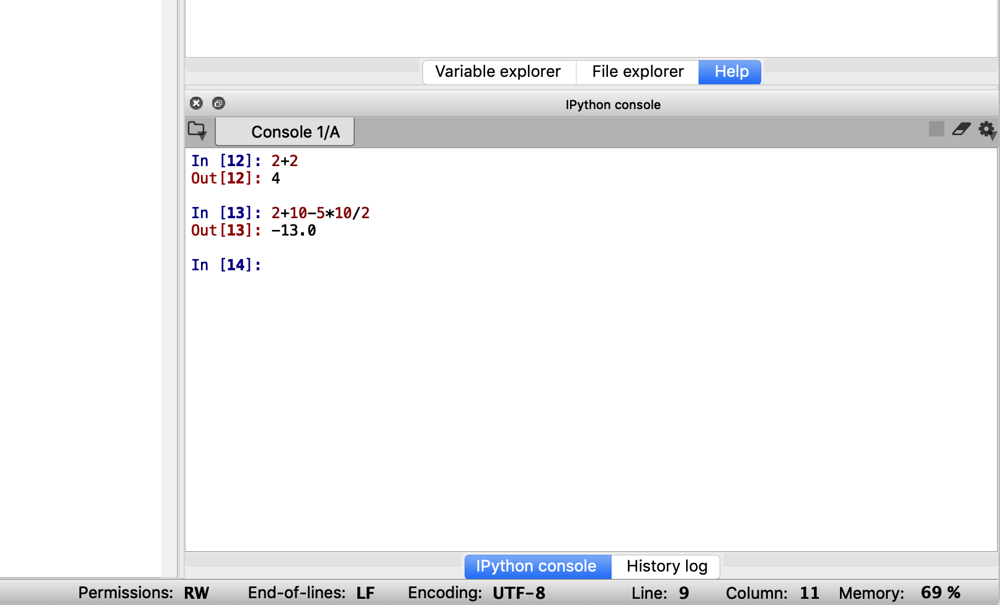
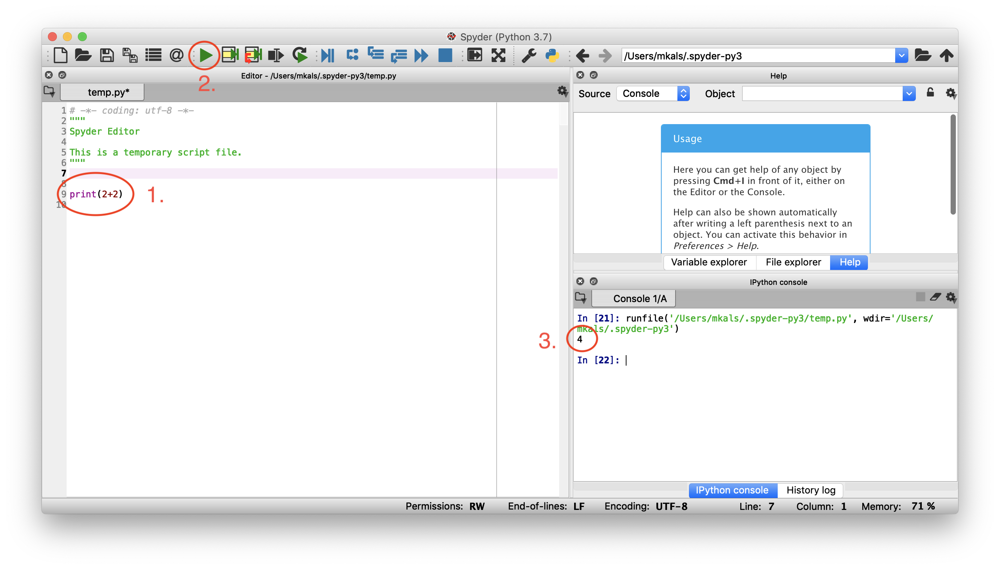

# 1. Learning Python
There are two ways you can execute Python code:
1. You can type instructions, line by line, into a Python console (such as the one in Spyder).
2. You can type your instructions in a file that you give a `.py` extension. This is especially useful if you have many lines of code that you want to execute.

We will start by typing instructions directly into the terminal in Syder. Afterward, when we progress to more complex programs, we will use the code editor to make files.

Launch Spyder through Anaconda. See the last section of [module 0](../0.%20Setting%20up%20the%20Tools) if you are unsure how to do this.

## Using python as a calculator
The easiest thing you can do with Python is to use it as a calculator. We will start by running this code directly from the Spyder Console window.

The lower right section of the Spyder window is the Console. Click on the console, and you are ready to type commands.

You can, for example, write `2+2` or `2+10-5*10/2` and hit return on your keyboard to make Python compute the result. This is how my screen looks after having executed these commands:



## Assigning variables
You can define variables by using the assignment operator `=`.
```python
a = 1
b = 2
a+b # will now be equivalent to saying 1+2
```

Note that the assignment operator is directional. It works by assigning the value of the right-hand side of `=` to the left-hand side. Therefore,
```python
a = 1 # a now holds the value 1
1 = a # error, can't assign to literal
```

You can update the value a variable contains by setting it equal to something else:
```python
a = 1
a = 2
a # will now be equal to 2, not 1
```

## Equality
If you want to check if two variables have the same value, you can do this using the `==` operator.
```python
a = 2
b = 4
a == b   # False
a+a == b # True
```

The single equals sign we just saw is an assignment. `a = 2` assigns the value of 2 to `a`. The double equals sign `==` tests for equality: `a == 2`
tests whether the value of `a` is equal to 2.

### Inequalities
Similarly, you can check for inequalities by using
- `a < b`, `a` less than `b`
- `a > b`, `a` greater than `b`
- `a <= b`, `a` less than or equal to `b`
- `a >= b`, `a` greater than or equal to `b`

## Strings
You can also set variables to be equal to text. For this to work, you need to surround the text with quotation marks:
```python
a = "this is a string,"
b = ' and this is another.'
a+b #  "this is a string, and this is another."
```

You can use either double quotes `"` or single quotes `'` to surround
a string, as long you end the string with the same one you start it with.

### Indexing
To get parts of a string, you can use indexing. Python uses zero indexing, meaning that the first character is located at index zero. See the example for more details on how it works:

```python
a = "physics"
a[0]    # 'p', first character of a
a[1]    # 'h', second character
a[-1]   # 's', last character
a[1:3]  # 'hy', the second and third character
a[1:-1] # 'hysic', all characters except the first and the last
a[1:]   # 'hysics', all characters except the first
```

## Lists
In the same way that you can collect characters in a string, you can collect other types of data (such as numbers) in a list.

If you know what values you want to store in your list, you can initialize a new list by surrounding your numbers with square brackets, and separating them by commas:

```python
numbers = [1, 2, 3, 40, 500]
```

As with strings, you can access individual elements in the list by using indexes:
```python
numbers[4]   # 500, returns the fifth element in the list
numbers[2:5] # [3,40,500], returns the third, fourth and fifth element in the list as a list
```

If you want to add a number to your list, you can use the `append()` method:
```python
numbers.append(2)
numbers # print all values in numbers
```

You can find the length of a list and the sum of a list by doing
```python
len(numbers) # works for any list
sum(numbers) # works only if the data-types stored in the list is a number
```

Thus, you can compute the mean of your list by
```python
mean = sum(numbers) / len(numbers)
mean # prints the variable to the screen
```

These are just a few things that you can do with numbers and lists. For more information, you can, for example, search the web for "python lists". You will find lots of great information, such as [this article from _Google for Education_](https://developers.google.com/edu/python/lists).

There are many other collection types in Python that do the same essential job as lists, but has more functionality. [Arrays](https://www.pythoncentral.io/the-difference-between-a-list-and-an-array/) are for example better for performing mathematical operations. [Numpy Arrays](https://docs.scipy.org/doc/numpy/reference/generated/numpy.array.html) are even more powerful. They are part of the `numpy` package for scientific computing in Python.


## Writing code in a file
If you want to make more complicated programs with commands that span across multiple lines, it is easier to have the code in a file rather than typing it into the terminal. You can do this as follows:
1. Type your code into the Python code editor in Spyder, which is located on the left side of the screen.
2. Click the green play button on the top of the screen.
3. Your program is executed, and its output is printed to the console.

Note: to make what you compute show up in the terminal, you must place it inside the parenthesis of `print()` as seen in the image below.




## Comments
The Python interpreter will skip anything that comes after `#` on a line. You can use this to write notes about what you are doing in your code, which can be useful for humans to understand what is going on. For example
```python
2**6 # is the python notation for exponentiation, i.e. 2^6
```

If you want your comment to span multiple lines, you can use a multiline comment:
```python
"""
This is a multiline comment.
It can be useful for writing longer comments!
"""
```

As you have noticed, the Spyder editor already populated your python file with a comment. It is good practice to start code-files with a comment saying what the code does and who made it, so feel free to change the comment generated by Spyder to what you think appropriate.


## `If` statements
It is possible to have parts of code execute only when you want it to.

The expression you place after `if` is evaluated by the Python interpreter to determine if it is `True` or `False`. If you go back to the section on equality, you will find that these operators are very useful in conjunction with `if` statements! You can for example say

```python
a = 5

if a == 5: # evaluates to True, as 'a' is set to 5
    a = 2  # this assignment is therefore executed

print(a)   # the value of 'a' has changed to 2

if a == 5: # evaluates to False
    a = 3  # not executed

print(a)   # 'a' is still 2
```

Python is a special language in that how you indent your lines (how many spaces you have before the first character on a line) matters. Therefore, the code below will print the value of `a` only if the `if` block is executed.

```python
a = 5
if a == 5:
    a = 2
    print(a)
```

## Loops
If you want to execute the same lines of code many times in a row, loops are handy.

### `While` loops
The `while` loop works a bit like the `if` statement. The difference is that the `while` loop will continue to execute the while block until the condition becomes `False`.

In the following code, for example, we print the numbers from 1 to 5.

```python
a = 0
while a < 5:
    a = a+1
    print(a)
```

### `For` loops
Another common type of loop is the `for` loop. It is very useful for looping through lists.

```python
list = [0, 5, 8, 4, 6]
for item in list:
    print(item * 2)
```

[This](https://www.learnpython.org/en/Loops) is a good resource for more information about loops.

## Functions
To make their code more readable and easy to reuse, programmers use functions. This is a very powerful concept that enables us to do a lot of computation in one line of code, simply by calling a function. It means that we do not need to know the exact details of how the function works.

You have used multiple functions already. `print()` is a function in Python that prints what you pass to it (what is inside the parenthesis) to the console. `len()` and `sum()` are other functions.

There are a few rules for defining Python functions:
- Function blocks begin with the keyword `def` followed by the function name, parentheses and a colon.
- Variables can be passed to the function by placing them inside the parenthesis. They are called function arguments or parameters. If you have multiple arguments, separate them using commas.
- The code block within every function is indented.
- The statement `return` exits a function. If you want, you can add a return argument that will be passed back to the caller of the function. A return statement with no arguments is the same as return `None`.

In summary, a function looks like this:
```python
def functionName(argument1, argument2):

  # code
  returnArgument = argument1 + argument2 # as an example

  return returnArgument
```

And you can call it by saying
```python
value = functionName(a, b)
```

- Inside the function, you will be able to access `a` as `argument1` and `b` as `argument2`.
- After the function has completed executing, `value` will have the same value as the variable `returnArgument` that you returned in the function.

Let us take a look at a practical example:

```python
# magnitude computes the length of a 2d vector specified by x and y
def magnitude(x, y):
  m = (x**2 + y**2)**0.5
  return m

print(magnitude(3,4)) # prints 5
```

One of the great benefits of Python is that so many people use it and write code for it. There are thousands of packages made by organizations and by the Python community that you can download. These libraries contain functions that you can call so that you do not have to implement core pieces of functionality yourself. This can speed your development up significantly!


### A few useful functions
Below you will find a small list of some handy functions in Python.

#### `range()`
You can declare a list of all numbers from zero to N by saying `range(N)`. This is very useful when executing loops for example:

```python
for index in range(100):
  # code is executed 100 times with index = 0, 1, 2, ..., 99
```

#### `abs()`
Returns the absolute value (magnitude) of a variable.

#### `min()`
Returns the smallest value in a list.

#### `max()`
Returns largest value in a list.

#### `round()`
Round a number to its nearest integer value.

#### `sorted()`
Sorts a list into ascending order.


## Object Oriented Programming
Object-oriented programming is a programming paradigm that makes it easy to bundle variables and functions into groups called objects. It makes it possible to think about blocks of code as physical objects that have certain properties and abilities.

The primitive data structures available in Python (numbers, strings, lists, etc.) are designed to represent simple things like the size of something, the name of a song, and your favorite colors, respectively.

If we want to represent something more complex, we can use a class. Classes are used to create new user-defined data structures that contain arbitrary information about something. A class can for example store strings and integers corresponding to the name and age of a person.

In the next module, we will use classes extensively, so it is good to become familiar with the syntax:

#### Importing a class from a library
Let us use the Arduino class as an example. You import the class Arduino from the library called Arduino using the command:
```Python
from Arduino import Arduino
```

#### Constructor
You can now initialize an _instance_ of this class by calling its constructor:
```Python
board = Arduino()
```
For the Arduino library, the initializer establishes a connection to the microcontroller. The board must be connected for this to work.

Depending on the class, you may have to pass some parameters to the constructor. For the Arduino class, you have optional parameters you can pass if you want to specify certain properties. You can find this type of information in the package [documentation](https://github.com/mkals/Arduino-Python3-Command-API).

We refer to `board` as an instance of the Arduino class. If you wanted to connect multiple microcontrollers to your computer, you can initialize multiple instances of the Arduino class.

#### Instance Methods
The Arduino class has instance methods you can call on your instance  `board` such as
```Python
value = board.version()
```
which returns the version of the Arduino-Python3 library that is running on the microcontroller.

These methods are like any other functions, except that they are able to access properties associated with the object instance (such as the serial connection to the Arduino board).

If you want to learn more about classes and how you can make your own, [this tutorial](https://realpython.com/python3-object-oriented-programming/) gives a good introduction. For basic programming with Python, it enough to know how you use them.


## Exercises
- Write a program that computes the sum of the 100 first natural numbers (1,2,3,4..100).
- Declare `string = "UBC Physics and Astronomy"`. Make a program that counts the number of 's' characters in this string.
- Make a function that takes one string as an argument, and returns the number of 's' characters in it. Can you make the character to search for be a parameter as well?
- Print all prime numbers smaller than 100.
- Write a function to compute the mode (the number that appears the most frequently) in a list of numbers.

## Resources
- An excellent resource for learning Python can be found [here](https://docs.python.org/2/tutorial/index.html).
- If you want to do more exercises, you can sign up at a website like [HackerRank](https://www.hackerrank.com) where you have access to hundreds of problems and where you can test your code automatically to see if you have gotten it right.

Next: [Module 2: Arduino for Data Collection](/2.%20Arduino%20for%20Data%20Collection/)
