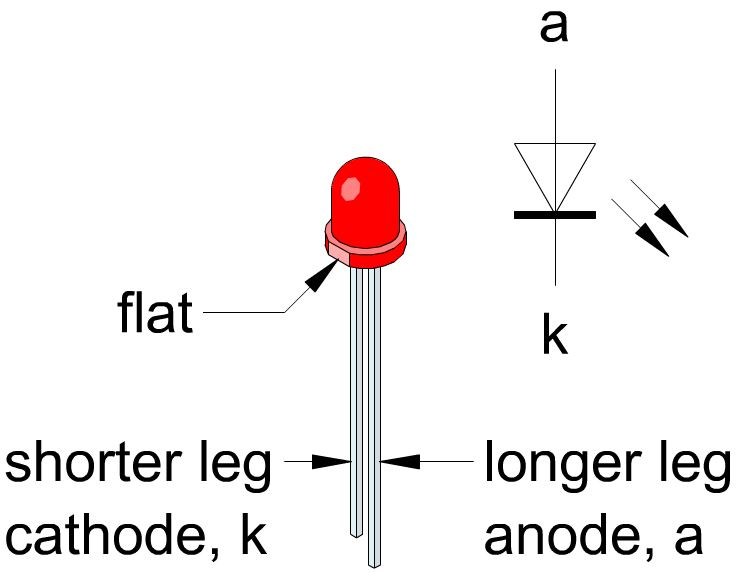
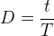
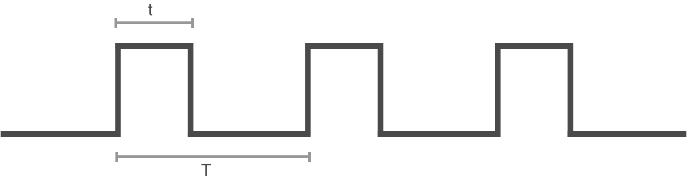
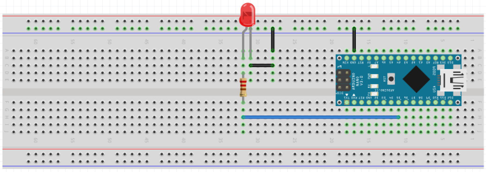
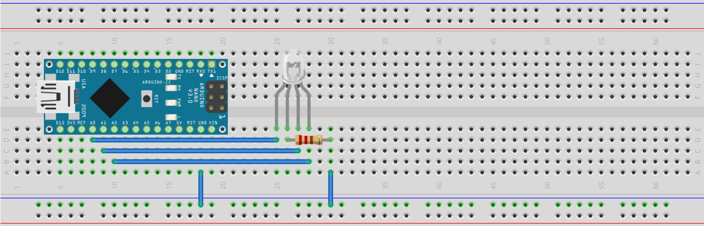

# 2. Arduino for Data Collection
## Terms
For this module, we will introduce multiple new concepts. The following list gives a brief explanation of each of the main concepts, with a link you can follow to find more information.

- [Microcontrollers](https://en.wikipedia.org/wiki/Microcontroller) are small computers where all the primary components have been placed in a single integrated circuit.
- [Arduino](https://www.arduino.cc) is the name of an Italian company delivering open source microcontroller hardware and supporting software. They have aquired a large community of users and developers.
- [C++](http://www.cplusplus.com/info/description/) is a very popular programing language. Arduino boards are programmed using a flavour of C++.
- [UART](http://www.circuitbasics.com/basics-uart-communication/) (Universal asynchronous receiver-transmitter) is a cumputer hardware device used for asyncronus serial communication.
- [Serial communication](https://en.wikipedia.org/wiki/Serial_communication) is a method of cumminicating information. It encodes the information you want to send into a sequence of bits (zeros and ones), and sends them sequencially over a communication channel.
- [LED](https://en.wikipedia.org/wiki/Light-emitting_diode) (light-emitting diode) is a semiconductor diode that produces light when electric current passes through it. Being a diode, it only allows current to pass in one direction.
- [RGB](https://en.wikipedia.org/wiki/RGB_color_model) is an abbreviation for the primary colors: Red, Green and Blue. Combining these colors virtually any color can be produced.
- RGB LED is a device where both a red, green and blue LED has been placed in one package.
- [Breadboard](https://en.wikipedia.org/wiki/Breadboard) is a tool for prototyping electronic circuits that allows the user to establish reliable temporary connections between components.
- [DMM](https://www.fluke.com/en-ca/learn/best-practices/measurement-basics/electricity/what-is-a-digital-multimeter) (digital multimeter) is a tool used to measure two or more electrical quantaties, such as voltage, current and resistance.
- [Digital signals](https://en.wikipedia.org/wiki/Digital_signal) are signals where information is communicated in descrete values (such as LOW and HIGH).
- [Analog signals](https://en.wikipedia.org/wiki/Analog_signal) are signals where information is communicated using a continous range of values.
- [PWM](https://www.arduino.cc/en/tutorial/PWM) (Pulse Width Modulation) is a teqnuice where a digital signal is rapidly turned on and off to produce what amounts to an analog signal.

## Introduction
Now, we are ready to start working with microprocessors. For this course, we will use the [Arduino Nano](https://store.arduino.cc/usa/arduino-nano) which is a small board based on the [ATmega328P](https://www.microchip.com/wwwproducts/en/ATmega328p) microcontroller.

To direcly program the Arduino Nano, you will have to use C++. Learning two programming languages at once is not easy. What we have done instead, is upload code to the boards so that you can control it by sending it commands from your computer through a serial interface called UART. In Python, you will write code that runs on your computer and that will send messages to the Arduino to control it. We will use the Arduino-Python library to achieve this.

### Breadboard
The breadboard is a very useful tool for prototyping. It allows us to connect components into circuits reliably without the need to solder. The internals of a breadboard is connected as shown in the image below. It is usual to use the horizontal traces on the side of the board as power (red) and ground (blue).

Note: For large breadboards, the power and ground rails may be split in the middle.

To verify how the breadboard is connected, use a multimeter to probe the pins. Some questions to consider:
- What setting on the mutlimeter should you use to to determine which pins are connected and which are not?
- How do you reliably obtain contact with the metal under the plastic cover of the breadboard with the thick multimeter probes?


### LED
Light emitting diodes are very useful devices for outputting light. Being diodes, they have a polarity. They only admit current to pass one way, from the anode to the cathode. You can see which side is the cathode by finding the side with a flat notch and shorter leg.

It is also important to ensure that the voltage across the diode does not exceed what it can withstand without overheating. LEDs typically have a forward voltage drop of between 1.8V and 3.3V and consume about 20mA during normal operation. Thus, as we want to drive them from 5V pins, we need to use a current limiting resistor in series with the diode. This resistor should be around 100 to 500 ohms.



### Digital logic
All computers (with the possible exeption of quantum computers) are based on binary digital logic. That is, there are only two states that any one signal can assume in the system. These two signals are reffered to as 0 and 1, OFF and ON, LOW and HIGH and so on.

Put simply, this system allows computers to make complicated decisions based on simple yes/no questions.

For the Aruino Nano, 5V is HIGH and 0V is LOW.

### Arduino Pins
The Arduino Nano has many pins that each can be configured to perform some function. Not all pins are equal. The abilities of each are written on the board for convenience. The most important ones are the following:
- `GND` means the pin is connected to the ground voltage level of the microcontroller.
- `Vin` means 5V, as that is the voltage we are powering the microcontroller with.
- `D` followed by a number (such as D13) signifies a digital pin. These pins can be configured to output LOW (0V) or HIGH (5V). They can also be used to read if the voltage applied to the pin is HIGH or LOW.
- `A` followed by a number (such as A2) are analog pins. In addition to being used as digital pins, they are capable of reading any voltage between 0V and 5V.
- The PWM capable pins of the ATMega328P are the digital pins 3, 5, 6, 9, 10, and 11. These are the only pins `analogWrite()` will work on.

### AnaligWrite
Because the Arduino is a digital divice, it does not really know how to produce analog voltages, that is: votlages other than 0V and 5V. In order to produce any intermediate voltage, we can however use a trick called PWM (puse width modulation). By turning the pin to HIGH and LOW very rapidly and varying the amount of time spent in the HIGH state relative to the time spent in the LOW state, it is possible to manipulate the average voltage so that it becomes what we want. If we want to produce 2.5V for example, we just have to spend as much time in the HIGH state as in the LOW state.

The amount of time spent in the HIGH state vs. the LOW state is characterized by a parameter called the duty cycle `D`, given by
<div style="text-align:center">

</div>




## Task 1: Controlling an LED

### Circuit
We are ready to connect our first circuit. Connect a 100 to 500 ohm resistor in series with the LED. This is to limit the current moving through the LED so that it does not overheat and get damanged.

Make sure to connect the cathode of the diode to ground. The cathode is the side with the shortest leg and with a small flat notch on the diode housing.

Notice that we are connecting the LED to pin D5. This will be important in the next step when we want to control this pin.



## Programming
Now, you can control the Arduino by typing the following lines of code into a new file in Spyder. The program will establish a connection with the Arduin over UART and set the LED to be on.

You need to update the variable `portName` to correspond to the name of the port that the Arduino is connected to. You can find this by following [these](Finding_USB_Port_Name.md) instructions.

```python
# import libraries
from Arduino import Arduino

portName = 'COM3'                      # example of Windows port name
#portName = '/dev/tty.usbserial-1410'  # exmaple of Mac port name

board = Arduino('9600', port=portName) # find and connect microcontroller
print('Connected')                     # confirms the microcontroller has been found

board.pinMode(5, 'OUTPUT')             # configure pin D5 to be an output pin

board.digitalWrite(5, 'HIGH')          # make LED light up
#board.digitalWrite(5, 'LOW')          # uncomment this line to turn LED off
```

You can now expand your program to do something more interesting. What about have the LED flash on and off continously? To achieve this, add the following to the code you just wrote:

```python
import time

# enter infinite loop
while True:
    board.digitalWrite(5, 'LOW')   # set pin LOW (0V)
    time.sleep(1)                  # wait 1 second
    board.digitalWrite(5, 'HIGH')  # set pin HIGH (5V)
    time.sleep(1)                  # wait 1 second
```

## Task 2: Controlling an RBG LED
We are now ready to look at an RGB LED. This is a device that contains a red, green and blue LED in one package. Contorlling the relative brigtness of the different color-channels will enable us to display just about any color, making this a very cool decvice to play with.

In order to be able to set the brightness of each pin, we will use the analog pins (marked with A folloed by a number) on the Arduino. These pins are able to output any voltage between 0V and 3.3V. We will later learn more about this feature.



Connect the LED as shown below. You will not be able to control the color of the led as follows:

Remember to update your port name to correspond to the port that the Arduino is connected to.

```python
# import libraries
from Arduino import Arduino
import time

portName = 'COM3'                      # example of Windows port name
#portName = '/dev/tty.usbserial-1410'  # exmaple of Mac port name

board = Arduino('9600', port=portName) # find and connect microcontroller
print('Connected')                     # confirms the microcontroller has been found

# give pins names so they are easy to refference
RED   = 3
GREEN = 5
BLUE  = 6

# configure A0, A1 and A2 as output pins
board.pinMode(RED, "OUTPUT")
board.pinMode(GREEN, "OUTPUT")
board.pinMode(BLUE, "OUTPUT")

# turn all LEDs off
board.analogWrite(RED, 0)
board.analogWrite(GREEN, 0)
board.analogWrite(BLUE, 0)


try:
    while True:
        board.analogWrite(RED, 255)     # set RED to full brightness (3.3V)
        time.sleep(1)                   # wait 1 second

        board.analogWrite(RED, 0)       # turn RED off
        board.analogWrite(GREEN, 255)   # set GREEN to full brightness (3.3V)
        time.sleep(1)                   # wait 1 second

        board.analogWrite(GREEN, 0)     # turn RED off
        board.analogWrite(BLUE, 255)    # set GREEN to full brightness (3.3V)
        time.sleep(1)                   # wait 1 second

        board.analogWrite(BLUE, 0)      # turn GREEN off

# press ctrl+c while the console is active to terminate program
except KeyboardInterrupt:
    pass
```

You can now modify the code to do what you want. Can you make the LED be yellow? What about making the color of the LED change gradualy?


### The Arduino-Python Library
The source for the Arduino-Python library can be found [here](https://github.com/thearn/Python-Arduino-Command-API). This repository includes a description of features and the source code that you can have a look at to figure out what other functions you can use with the Arduino board. In the next module, we will use the `pulseIn_set` function to measure the distance to objects using an ultrasonic range finder.

Next: [Module 3: Ultrasonic Range Sensing](/3.%20Ultrasonic%20Range%20Sensing/)
