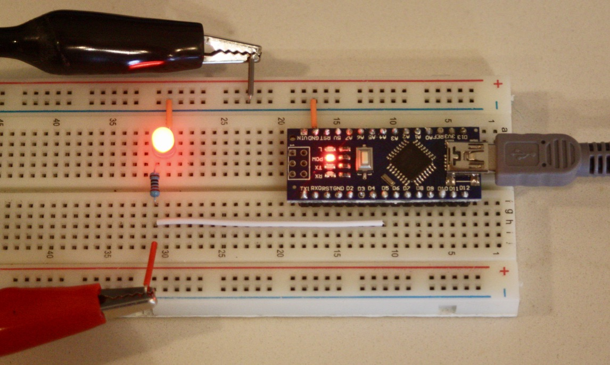
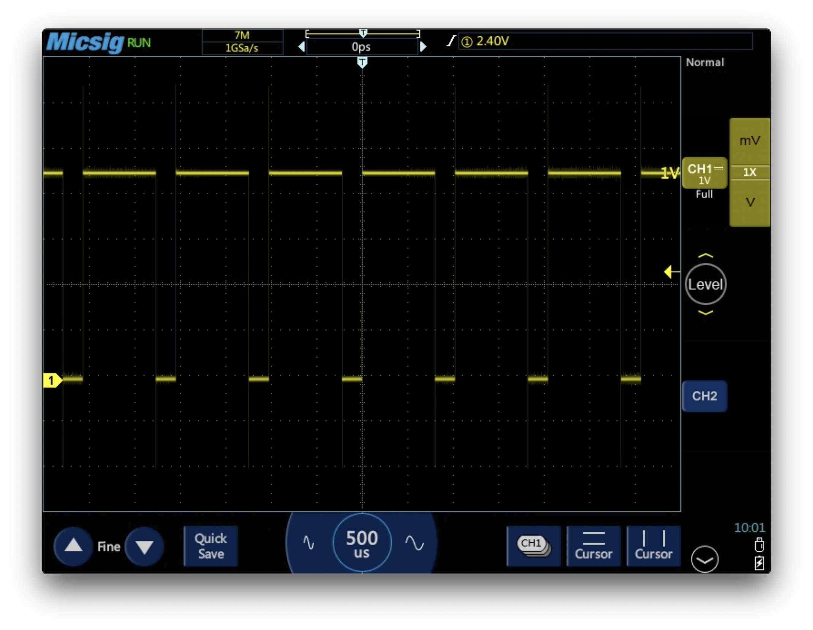
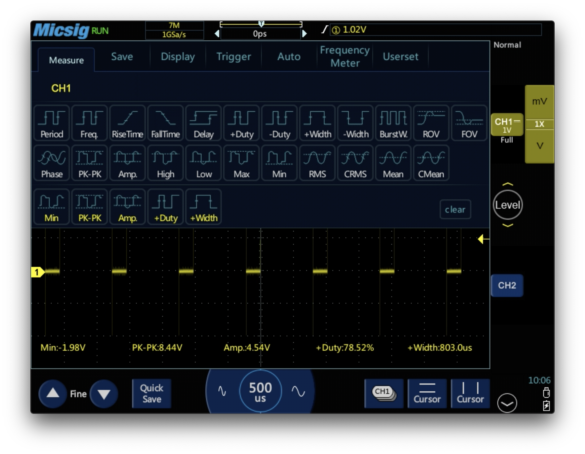

# 2. Arduino for Data Collection

## Introduction
Now, we are ready to start working with microprocessors. For this course, we will use the [Arduino Nano](https://store.arduino.cc/usa/arduino-nano) which is a small board based on the [ATmega328P](https://www.microchip.com/wwwproducts/en/ATmega328p) microcontroller.

To directly program the Arduino Nano, you will have to use C++. Learning two programming languages at once is not easy. What we have done instead, is upload code to the boards so that you can control it by sending commands from your computer through UART (see definition below). In Python, you will write code that runs on your computer, and that will send messages to the Arduino to control it. We will use the Arduino-Python library to achieve this.

This module relies on a lot of concepts and technologies, some of which you may not have hard of before. There is a glosary and theory section at the end of the lab that you can refference.

## Task 1: Getting Familiar with the Breadboard
To understand how the breadboard is connected, use a multimeter to probe the pins.

Some questions to consider:
- Which setting on the multimeter should you use to determine which pins are connected and which are not?
- How do you reliably obtain contact with the metal under the plastic cover of the breadboard with the thick multimeter probes?

Draw a picture of the breadboard and its internal connections in your lab notebook.

## Task 2: Controlling an LED
We start by using the microcontroller to drive an LED.

### Circuit
- Place a 100 to 500 ohm resistor in series with the LED. The resistor limits the current moving through the LED so that it does not overheat and get damaged.
- Make sure to connect the cathode of the diode to ground. The cathode is the side with the shortest leg and with a small flat notch on the diode housing.
- Notice that we are connecting the LED to pin D5. This will be important in the next step when we want to control this pin.

After you are sure you have connected everything correctly, you can connect the Arduino Nano to your computer using the USB cable. You will see a red status LED on the Arduino board turn on to indicate the Arduino is powered on and ready to execute your commands.


### Programming
Now, you can control the Arduino by typing the following lines of code into a new file in Spyder. The program will establish a connection with the Arduino over UART and set the external LED to be on.

You need to update the variable `portName` to correspond to the name of the port on your computer that the Arduino is connected to. You can find the port by following [these instructions](Finding_USB_Port_Name.md).

```python
# import libraries
from Arduino import Arduino
import time

PORT_NAME = 'COM3'                    # example of Windows port name
#portName = '/dev/tty.usbserial-1410' # exmaple of Mac port name

board = Arduino('115200', port=PORT_NAME) # find and connect microcontroller
print('Connected')                      # confirms the microcontroller has been found

time.sleep(2)                 # wait for 2 seconds to allow microcontroller to reboot

board.pinMode(3, 'OUTPUT')    # configure pin D5 to be an output pin

board.digitalWrite(3, 'HIGH') # make LED light up
```

Things to note:
- You must type `'OUTPUT'`, `'HIGH'` and `'LOW'` with the capital letters.
- If you have problems, try disconnecting and reconnecting the Arduino or restarting the kernel in Spyder.
- The microcontroller will reboot every time a serial connection is establised. A delay is used to allow the microcontroller to boot so that it can process the two commands sent.
- If the program does not work, you can try increasing this delay or moving on to the next part where more commands are sent.
- If the LED does not turn on, you can try truning it around to see if it was inserted the wrong way.

If you get the error message
`SerialException: could not open port 'COM3': PermissionError(13, 'Access is denied.', None, 5)`, disconnect and reconnect the Arduino. This happens because the serial connection has not been closed properly. We will fix this issue further on.

#### Flashing LED
You can now expand your program to do something more interesting. What about making the LED flash on and off continuously? To achieve this, add the following to the code you just wrote:

```python
# enter infinite loop
while True:
    board.digitalWrite(3, 'LOW')   # set pin LOW (0V)
    time.sleep(1)                  # wait 1 second
    board.digitalWrite(3, 'HIGH')  # set pin HIGH (5V)
    time.sleep(1)                  # wait 1 second
```

This is what is called an infinite loop - a loop that will never stop executing. To terminate the program, you have to click the red square stop button located in the top right corner of the Spyder Console.


#### Controlling LED brightness
Imagine if the above code was executed with a very small delay between each the LED was turned on and off. It is going to appear as though the LED is half as bright, as it only turned on half the time. By altering the ratio of time the LED is on to how long it is off, we can further control the brightness of the LED.

The function `analogWrite` continuously turns the output on and off, with a duty cycle specified by the second argument to the function. D = 255 corresponds to a duty cycle of 100% (fully on), and D = 0 corresponds to a duty cycle of 0% (fully off).

Alter your code to use the analog print function. It could look something like this.

```python
# import libraries
from Arduino import Arduino

portName = 'COM3'                      # example of Windows port name

board = Arduino('115200', port=portName) # find and connect microcontroller
print('Connected')                     # confirms the microcontroller has been found

board.pinMode(5, 'OUTPUT')             # configure pin D5 to be an output pin

board.analogWrite(5, 200)              # set LED to half brightness
```


### Visualizing PWM using Oscilloscope
Now, use the oscilloscope to see how the voltage to the LED changes with time. Connect the oscilloscope ground probe to the ground rail on the breadboard, and connect the signal probe to the digital output pin D5 on the Arduino that we are using to drive the LED.


- Turn off the second channel CH2 on the cope, as we are not using it.
- Adjust the scope time scale and voltage level for CH1 so that you see a PWM wave as shown in this picture.


- Drag down from the top of the screen to show the menu.
- Select `Measure` and activate `Duty` (duty cycle), `Width`, `Period` and `Frequency`.



- Try changing the duty cycle in code, and see how the shape on your oscilloscope changes.

#### Question
Are these measurements what you expect them to be? Does the duty cycle correspond with what you set it to?

Note:
- The clock frequency of the ATMega328P is 16 MHz. It uses 8-bit resolution for its PWM outputs. That is, the microprocessor counts to 2^8 = 256 once for every rising edge it generates.
- Your argument to the `analogWrite` function dictates how many of the 256 clock cycles the pin should be held in the `HIGH` state.

If you have time, you can take a look at [this module about transient behaviour](Voltage_Transients.md).

## Task 3: Controlling an RGB LED
We are now ready to look at an RGB LED. This is a device that contains a red, green and blue LED in one package. Controlling the relative brightness of the different color-channels will enable us to display just about any color, making this a very cool device to play with.

To be able to set the brightness of each pin, we will have to use the PWM enabled pins of the Arduino Nano. You can use pins D3, D5, and D6 as shown in the circuit below.


Remember to include current limiting resistors in your circuit, and to update `portName`.

The following code will continuously flash the three primary colors for 1 second each.

The `try: except` block is part of Python's error handling functionality. Placing your loop inside this statement enables you to use the shortcut `ctrl` + `c` to terminate the program (the console must be active for this to work). This shortcut is very commonly used to terminate program execution.

The `except` block also closes the serial connection to the board properly whenever the user termiates program execution.

```python
# import libraries
from Arduino import Arduino
import time

PORT_NAME = 'COM3'                      # example of Windows port name
#portName = '/dev/tty.usbserial-1410'  # exmaple of Mac port name

board = Arduino('115200', port=PORT_NAME) # find and connect microcontroller
print('Connected')                     # confirms the microcontroller has been found

# give pins names, so they are easy to reference
RED   = 3
GREEN = 5
BLUE  = 6

# configure the pins as outputs
board.pinMode(RED, "OUTPUT")
board.pinMode(GREEN, "OUTPUT")
board.pinMode(BLUE, "OUTPUT")

# turn all LEDs off
board.analogWrite(RED, 0)
board.analogWrite(GREEN, 0)
board.analogWrite(BLUE, 0)


try:
    while True:
        board.analogWrite(RED, 255)     # set RED to full brightness (3.3V)
        time.sleep(1)                   # wait 1 second

        board.analogWrite(RED, 0)       # turn RED off
        board.analogWrite(GREEN, 255)   # set GREEN to full brightness (3.3V)
        time.sleep(1)                   # wait 1 second

        board.analogWrite(GREEN, 0)     # turn RED off
        board.analogWrite(BLUE, 255)    # set GREEN to full brightness (3.3V)
        time.sleep(1)                   # wait 1 second

        board.analogWrite(BLUE, 0)      # turn GREEN off

# press ctrl+c while the console is active to terminate the program
except KeyboardInterrupt:
    board.close() # close the serial connection
```


### Exercises
You can now modify the code.
- Can you make the LED be orange?
- What about making the color of the LED change gradually?


## Theory

### DMM and Oscilloscope
When we start to work with hardware, it is important that we have the tools to visualize what is happening. This will enable us to understand what is going on at all steps, and it will give us the ability to debug the system systematically if something is not working as we expect it to.

- The DMM (digital multimeter) is a great tool for measuring any parameter that does not change with time, such as resistance and current and voltage at DC (direct current).
- The oscilloscope is designed for measuring voltages that vary over time. This enables you to observe voltages at AC (alternating current). The oscilloscope also makes it possible to capture what is commonly referred to as transient behavior - that is, events that happen for a limited period of time as an external trigger moves a system form one equilibrium position to another.

Ask the instructor or TAs if you are not familiar with the use of these tools.

### Breadboard
A breadboard is a handy tool for prototyping. It allows us to connect components into circuits reliably without the need to solder. The internals of a breadboard is connected as shown in the image below. It is usual to use the horizontal traces on the side of the board as power (red) and ground (blue).

Note: For large breadboards, the power and ground rails may be split in the middle.


### LED
Light emitting diodes output light while drawing very little current. Being diodes, they have a polarity. They only admit current to pass one way, from the anode to the cathode. You can see which side is the cathode by finding the side with a flat notch and shorter leg.

It is also important to ensure that the voltage across the diode does not exceed what it can withstand without overheating. LEDs typically have a forward voltage drop of between 1.8V and 3.3V and consume about 20mA during normal operation. Thus, as we want to drive them from 5V pins, we need to use a current limiting resistor in series with the diode. This resistor should be around 100 to 500 ohms.


### Digital logic
All computers (with the possible exception of quantum computers) are based on binary digital logic. That is, there are only two states that signals can assume in the system. These two signals are referred to by many names: 0 and 1, OFF and ON, LOW and HIGH and so on. This system allows computers to make complicated decisions based on simple yes/no questions.

For the Arduino Nano, 5V is HIGH, and 0V is LOW.

### Arduino Pins
The Arduino Nano has many pins that each can be configured to perform some function. Not all pins are equal. The abilities of each are written on the board for convenience. The most important ones are the following:
- `GND` means the pin is connected to the ground voltage level of the microcontroller.
- `Vin` means 5V, as that is the voltage we are powering the microcontroller with.
- `D` followed by a number (such as D13) signifies a digital pin. These pins can be configured to output LOW (0V) or HIGH (5V). They can also be used to read if the voltage applied to the pin is HIGH or LOW.
- `A` followed by a number (such as A2) are analog pins. In addition to being used as digital pins, they are capable of reading any voltage between 0V and 5V.
- The PWM capable pins of the ATMega328P are the digital pins 3, 5, 6, 9, 10, and 11. These are the only pins where you can use `analogWrite()`.

### AnalogWrite
Because the Arduino is a digital device, it does not know how to produce analog voltages. That is, voltages other than 0V and 5V. To produce an intermediate voltage, we can, however, use a trick called PWM (pulse width modulation). By turning the pin to HIGH and LOW very rapidly and varying the amount of time spent in the HIGH state relative to the time spent in the LOW state, it is possible to manipulate the average voltage so that it becomes what we want. If we want to produce 2.5V for example, we just have to spend as much time in the HIGH state as in the LOW state.

The amount of time spent in the HIGH state vs. the LOW state is characterized by a parameter called the duty cycle `D`, given by
<div style="text-align:center">

</div>


Note that this is not a true analog voltage. For motors, diodes and other devices, it is ok to use PWM to achieve an analog voltage. It is not possible to use this trick for many other applications, such as powering digital circuits.

### The Arduino-Python Library
The source for the Arduino-Python library can be found [here](https://github.com/thearn/Python-Arduino-Command-API). This repository includes a description of features and the source code that you can have a look at to figure out what other functions you can use with the Arduino board. In the next module, we will use the `pulseIn_set` function to measure the distance to objects using an ultrasonic range finder.

Next: [Module 3: Ultrasonic Range Sensing](/3.%20Ultrasonic%20Range%20Sensing/)


## Terms
The following list gives a brief explanation of each of the main concepts, with a link you can follow to find more information.

- [Microcontrollers](https://en.wikipedia.org/wiki/Microcontroller) are small computers where all the primary components have been placed in a single integrated circuit.
- [Arduino](https://www.arduino.cc) is the name of an Italian company delivering open source microcontroller hardware and supporting software. They have acquired a large community of users and developers, and the name Arduino is now synonymous with their development boards.
- [C++](http://www.cplusplus.com/info/description/) is an important programing language. Arduino boards are programmed using a flavor of C++.
- [UART](http://www.circuitbasics.com/basics-uart-communication/) (Universal asynchronous receiver-transmitter) is a computer hardware device used for asynchronous serial communication.
- [Serial communication](https://en.wikipedia.org/wiki/Serial_communication) is a method of communicating information. It encodes the information you want to send into a sequence of bits (zeros and ones) and transmits them sequentially over a communication channel.
- [LED](https://en.wikipedia.org/wiki/Light-emitting_diode) (light-emitting diode) is a diode that produces light when an electric current passes through it. Being a diode, it only allows current to flow in one direction.
- [RGB](https://en.wikipedia.org/wiki/RGB_color_model) is an abbreviation for the primary colors: red, green, and blue. Combining these colors virtually any color can be produced.
- RGB LED is a device where both a red, green and blue LED has been placed in one package.
- [Breadboard](https://en.wikipedia.org/wiki/Breadboard) is a tool for prototyping electronic circuits that allows the user to establish reliable temporary connections between components.
- [DMM](https://www.fluke.com/en-ca/learn/best-practices/measurement-basics/electricity/what-is-a-digital-multimeter) (digital multimeter) is a tool used to measure two or more electrical quantities, such as voltage, current, and resistance.
- [Oscilloscope](https://learn.sparkfun.com/tutorials/how-to-use-an-oscilloscope/introduction) is a tool that can sample voltage readings very rapidly, and plot a graph of how voltage varies with time. This enables you to investigate periodic behavior in voltage as well as capturing transient events.
- [Digital signals](https://en.wikipedia.org/wiki/Digital_signal) are signals where information is communicated in discrete values (such as LOW and HIGH).
- [Analog signals](https://en.wikipedia.org/wiki/Analog_signal) are signals where information is communicated using a continuous range of values.
- [PWM](https://www.arduino.cc/en/tutorial/PWM) (Pulse Width Modulation) is a technique where a digital signal is rapidly turned on and off to produce what amounts to an analog signal.
