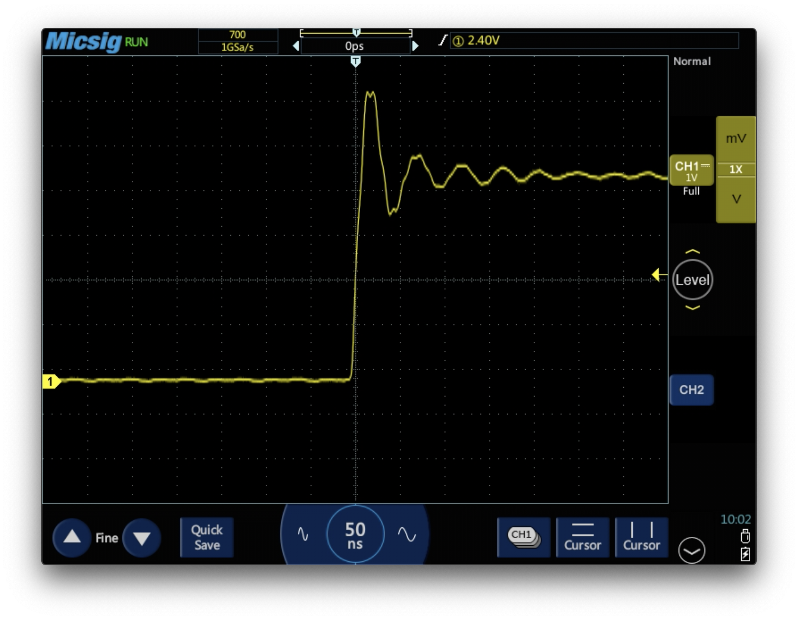
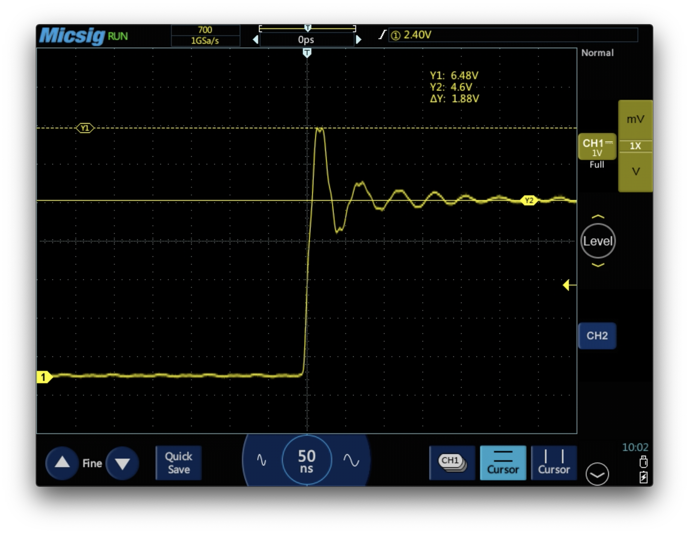
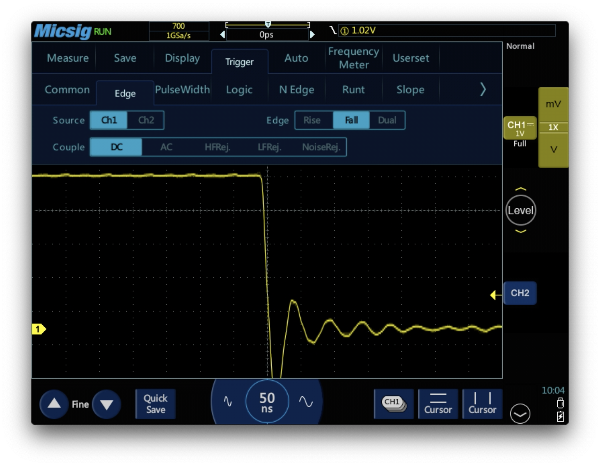

# Voltage Transients

In an ideal digital system, the voltage can only have two set values: HIGH or LOW. This is not the case in real life though. Electronics will use some finite amount of time transitioning between the two logic states, and this might introduce problems.

Transient is a word used to describe behaviour that is temporary in nature. Here, we use the word to reffer to how the voltage behaves when tracking from one equilibrium positon to another.

We can visualize some of these effects using an oscilloscope and the square wave produced by the Arduino using `analogWrite`. The setup is described in module 2.

- Zoom in on one of the rising edges by adjusting the time scale.

This oscillatory behaviour is surprising. It is caused, in part, by capacitance in the breadboard and inductance in the leads of the oscilloscope probe. The oscilaltions are, in other words, exassirbated by us making a mesurnment on the system.

- Use the cursors to measure the amplitude of the oscillations

- Bring down the menu (by swiping down from the top of the screen).
- Go to the `Trigger` section and trigger on a falling edge.

