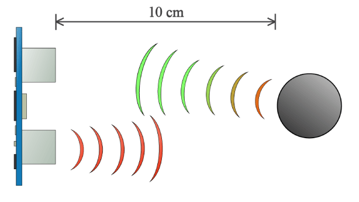
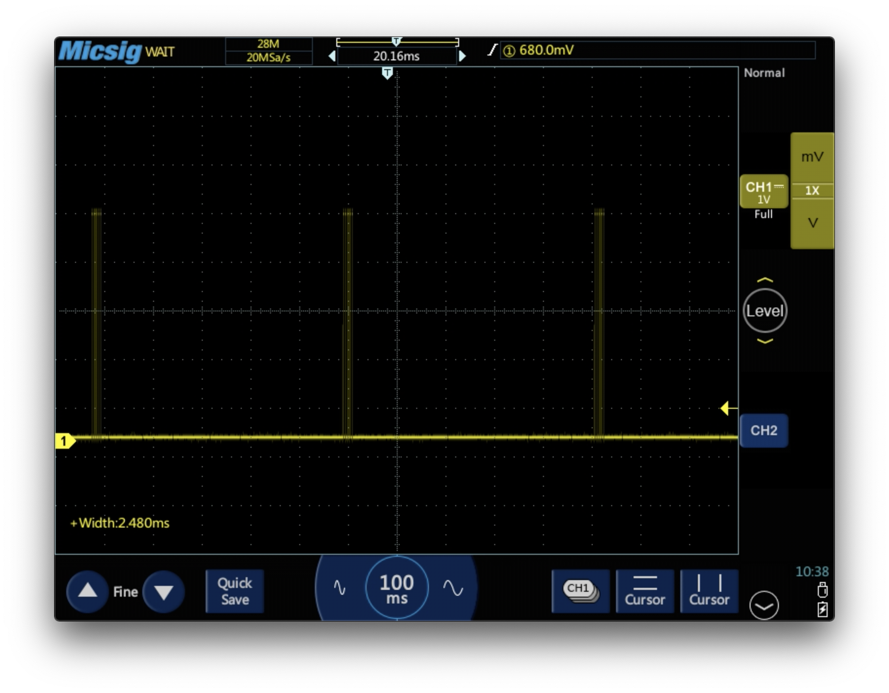
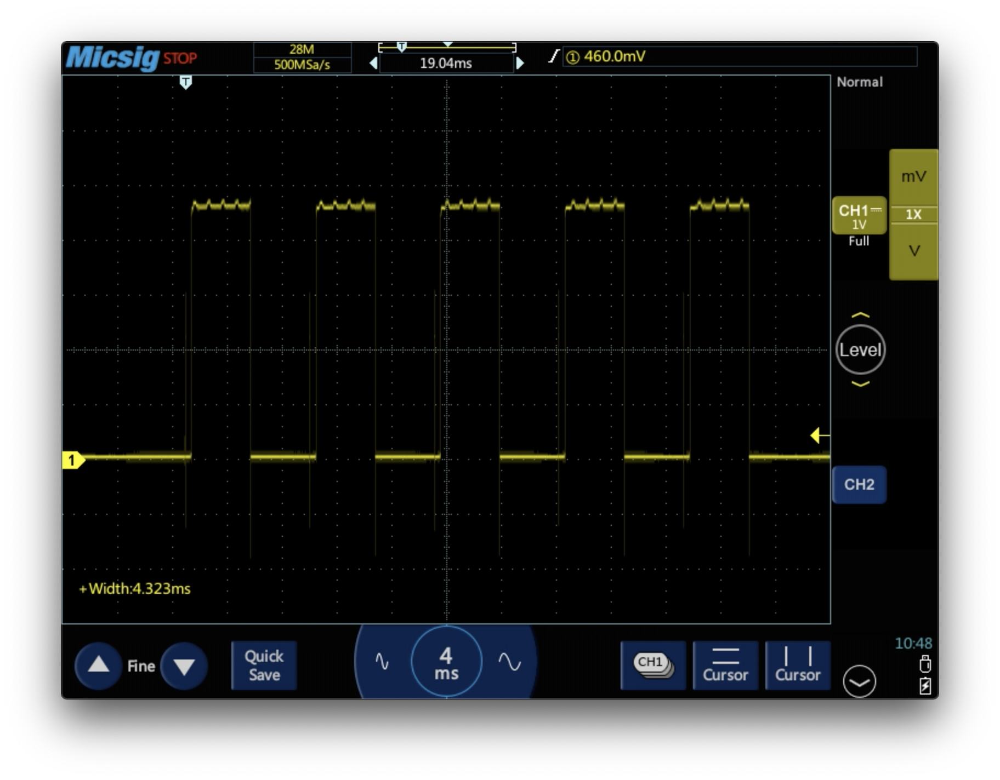

# 3. Ultrasonic Range Sensing

## Theory
The HC-SR04 is an inexpensive distance sensor that is easy to work with. It uses two ultrasonic transducers, one acting as a speaker and one serving as a microphone. The left transducers emit a high-frequency sound pulse that travels through the air. When it hits a solid surface, these pulses are reflected back towards the module. The microphone registers this echo. The time required for the sound to make the trip away and back is used to determine how far the sound has traveled, and thus the distance to the obstacle.



## Sensor Module
The ultrasonic sensor module makes it easy to get distance data by abstracting out a lot of the work associated with actuating the speaker and recognizing the echoes.

It has a 4 pin interface:
- PWR is power. It is connected to 5V.
- GND is ground. It is connected to a ground pin of the microcontroller.
- TRIG is the trigger pin. It is connected to a digital pin of the microcontroller.
- ECHO is the echo pin. It is connected to a digital pin of the microcontroller.

In our case, we will connect TRIG and ECHO to the same pin, as this will enable us to use a convenient function in the Arduino-Python library called `pulseIn_set`.

Getting a distance measurement from the module works like this:
- When you want to make a distance measurement, send a quick pulse to the sensor on the trigger line.
- The ultrasonic module with use the speaker to send out a sound-pulse and wait for an echo to come back.
- When the module detects an echo, it sends a pulse to the microcontroller over the ECHO wire.
- The time difference between when the trigger pulse was transmitted and when the echo pulse returned can be used to determine how far the sound has traveled (distance = speed * time).


## Code
### Get Distance Measurements

In your code, you will need to keep track of how long it has taken from the trigger pulse was sent to the echo returns. We could write this functionality manually, but it is easier and more accurate to use a library function called `pulseIn_set`.

#### `pulseIn_set` Function Spesification
- inputs:
  - `pin`: pin number for pulse measurement
  - `val`: "HIGH" or "LOW". Pulse is measured when this state is detected
  - `numTrials`: number of trials used for average. Default value is 5.
- returns:
  - `duration`: an average of pulse length measurements

#### `pulseIn_set` Operation
This function works as follows:
1. Set `pin` to the OUTPUT mode.
2. Set `pin` to the opposite logic level of `val` and wait a little.
3. Set `pin` to the logic level of `val`. For the ultrasonic sensor, this will trigger a distance measurement.
4. Start a timer.
5. Set `pin` to the INPUT mode.
6. When the logic level of `pin` is pulled to LOW by the ultrasonic sensor, stop the timer.
7. Repeat steps 1 to 6 `numTrials` times (if no number specified, use repeat five times).
8. Average the time from all the `numTrials` distance measurements, and return this value.

That is quite a lot going on!

#### Code

You now know all you know to start writing code to interface with the ultrasonic sensor. It can look something like this:

```python
from Arduino import Arduino
import time

PORT_NAME = '/dev/tty.usbserial-1420' # MUST BE UPDATED TO USE THE CORRECT PORT
PIN_SENSE = 12                        # pin where ultrasic sensor is connected

# connect to Arduino
board = Arduino('9600', port=PORT_NAME)
print('Connected')

try:
    while True:
        pulseTime = board.pulseIn_set(PIN_SENSE, 'HIGH') # in micro-seconds
        print(pulseTime)

        time.sleep(0.5)

# press ctrl+c while the console is active to terminate the program
except KeyboardInterrupt:
    pass
```

By running this program, you should see numbers print to your console in rapid succession.
- Observe how the numbers change when you point the ultrasonic sensor in different directions.

### Visualizing Communication with Scope
While you are running the program you wrote above, use the oscilloscope to see how the communication between the Arduino and the ultrasonic module works. This will also enable you to measure the pulse duration and compare the value you obtain to that reported by the Arduino.

There will be a significant delay between each pulse-train, as we are using the `time.sleep()` function to avoid sending commands over the UART interface too quickly. This will make it more difficult to get the right image displayed on the screen. Use the `Stop/Run` and `Single SEQ` buttons to the right of the oscilloscope screen to collect snapshots of the wave that you can spend time analyzing before resampling.

- Start by making the period long, so that you can see multiple pulse-trains.


- Now, zoom in on one of the peaks. You will see that it consists of five square waves. Why are there five? How would you change the code to alter the number of peaks?
- Use the cursors or the measure function to find the width of the pulses. Do they vary?


- Change the distance from the ultrasonic module its nearest obstacle.

#### Questions
- How does this change the waves you observe on the oscilloscope? Is this in accordance with what you would expect?
- How does the pulse width compare to the reading printed to your screen by the Arduino?


### Calibrating for Distance Measurement
- By using a ruler, you can manually determine how far the sound has traveled.
- Find a scaling factor that makes the value printed by the Arduino correspond to the distance to an obstacle (and not the time it took the sound to travel out and back as it currently is doing).

Hint: how different is the constant of proportionality you get from [this](https://www.google.com/search?client=safari&rls=en&q=the+speed+of+sound+in+air&ie=UTF-8&oe=UTF-8)?

### Writing to file
You can use the `csv` library to write data to a file. This can be very useful for data analysis and will be used in the next module where you use the ultrasonic range finder for conducting an experiment.

```python
from Arduino import Arduino
import time

# NEW, import csv library
import csv

PORT_NAME = '/dev/tty.usbserial-1420' # MUST BE UPDATED TO USE THE CORRECT PORT
FILE_NAME = 'pendulum_data.csv'       # name of file that data will be written to
PIN_SENSE = 12                        # pin where ultrasic sensor is connected

# connect to Arduino
board = Arduino('9600', port=PORT_NAME)
print('Connected')
f = open(FILE_NAME,'a')              # open a file for 'a'ppending
writer = csv.writer(f,delimiter=',') # prepare for writing to file

# Write data-field titles to file
writer.writerow(['Counter', 'Time (s)', 'Distance (cm)'])

startTime = time.time() # capture current time as datum

try:
    while True:
        # make distance measurement
        pulseTime = board.pulseIn_set(PIN_SENSE, 'HIGH')
        distance = pulseTime * 0.034 / 2; # in cm

        # write list of data to file
        currentTime = time.time()-startTime
        data = [currentTime, distance]

        writer.writerow(data) # write data to file
        print('time = %5.2f   distance = %5.1f' % tuple(data))

        time.sleep(0.5) # delay to keep UART bus for getting overloaded

# press ctrl+c while the console is active to terminate the program
except KeyboardInterrupt:
    f.close() # close file gracefully when program is terminated
```

### Extra Exercise: Handling Exceptions
If an obstacle is placed to close to the ultrasonic sensor, or if the obstruction too far away, the number returned may be off. Can you write some lines of code to output zero if the distance-measurement seems suspicious?


Next: [Module 4: Pendulum Experiment](/4.%20Pendulum%20Experiment/)
