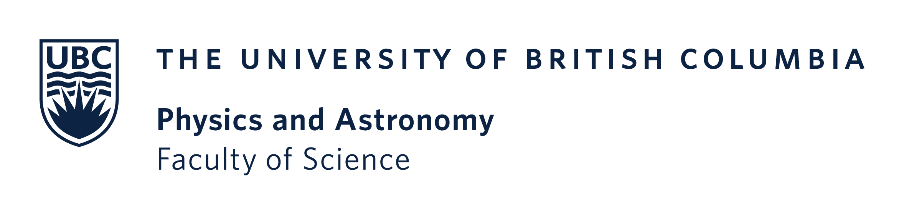

# Lab Skills Workshop
Welcome to this workshop aimed at developing practical experience with data-collection and instrumentation!

This workshop is targeted at students who will be going into 2nd-year physics in September and who feel that they lack confidence in their laboratory and computing skills. The workshop is intended to be a not-for-credit primer for such courses as Phys210 (Computational Physics) and Phys219 (Experimental Physics).

The training is divided into modules. Start with module zero to get the programs you need installed and running. The rest of the modules follow in chronological order, each building on the progress of the last.

## Modules
0. [Setting up the Tools](/0.%20Setting%20up%20the%20Tools/)
1. [Learning Python](/1.%20Learning%20Python/)
2. [Arduino for Data Collection](/2.%20Arduino%20for%20Data%20Collection/)
3. [Ultrasonic Range Sensing](/3.%20Ultrasonic%20Range%20Sensing/)
4. [Pendulum Experiment](/4.%20Pendulum%20Experiment/)
5. [Extra Exersises](/5.%20Extra%20Exersises/)

## Workshop goals
- to get started with the Python language and control a microcontroller with Python
- to learn how to calibrate sensors and make/display/analyze measurements
- to debug an electrical circuit with an oscilloscope

You will leave the workshop with Python running on your laptop, and with an Arduino Nano microcontroller, an ultrasound distance-measuring device, a breadboard, and cables.
